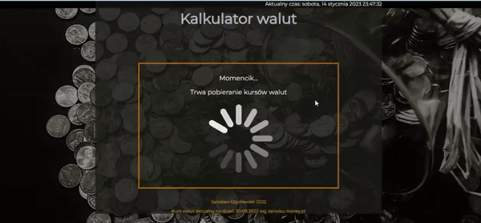
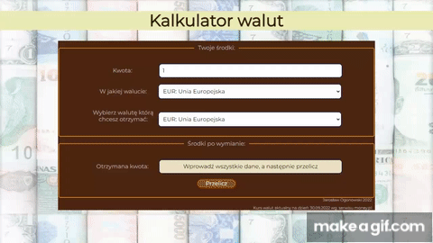

# Currency calculator - React

I invite you to familiarize yourself with the application...

Demo here:
https://jaroslawogonowski.github.io/Currency-calculator-react/

The project consists in transferring the application I created earlier to the React environment,
at the same time, the visual layer has been improved, and the application was adapted to screens below 767px.

## Technologies used:
- HTML
- CSS
- Styled Components
- JavaScript
- React
- Axios
- useState
- useEffect
- custom hooks
- async
- GlobalStyle

An older version can be seen here:
https://jaroslawogonowski.github.io/currency-calculator/

Of course, all the scripting has changed. Now everything is based external API, which makes application management much easier and clearer.